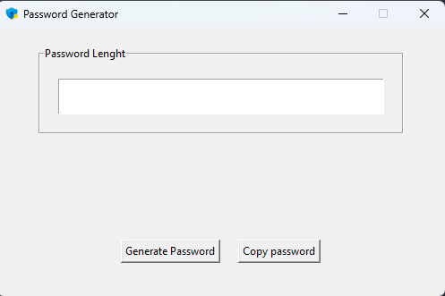

# Password Generator App 🔐
This is a basic program, as its name suggests, generates random passwords.

## How to use it ⌨️
1. Simply type the desired length of your password
2. Press the ***Generate Password*** button
3. You can also copy your password to your clipboard pressing the ***Copy Password*** button.

<!--Screenshot-->

## Free Usage
I made this basic program with an educational purposes.

I relied [Codemy.com's tutorial](https://www.youtube.com/watch?v=XaVp2l6Z_Dc) as the main guide for developing this program.

Feel free to clone this repository, modify the code, and make changes.
Enjoy your coding time! 😁⌨️.

## Convert the python file into an .exe 🐍
If you want to convert this file into a window's executable file just follow these steps:

1. Open your terminal
2. Install pyinstaller `pip install pyinstaller`
3. Select the python file named ***password_generator_app.py*** and the ***icon.ico*** file.
    ~~~
    pyinstaller --onefile password_generator_app.py
    ~~~
4. Press ***Enter***.
5. **Done!** 🥳
